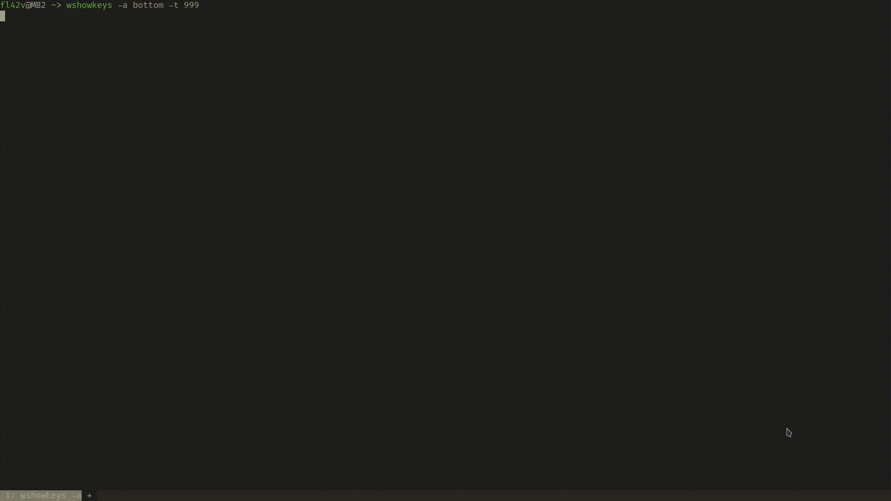

# OBSOLETE since hyprland 0.55

with lua configuration the same can be achieved with

```lua
local mainMod = "SUPER" -- Sets "Windows" key as main modifier

local function chkpos(comp)
  local win = hl.get_active_window()
  local wins = hl.get_windows()
  local flag = true
  for _,w in ipairs(wins) do
    if w.workspace == win.workspace
      and w.monitor == win.monitor
      and w.visible
      and comp(w, win)
    then
      flag = false
      break
    end
  end
  return flag
end

-- focus

hl.bind(mainMod .. " + h",  function()
  if chkpos(function (w, win) return w.at.x < win.at.x end) then
    hl.dispatch(hl.dsp.focus({monitor = "m+1"}))
  else
    hl.dispatch(hl.dsp.layout("focus l"))
  end
end)

hl.bind(mainMod .. " + j", function ()
  if chkpos(function(w, win) return (w.at.y + w.size.y) > (win.at.y + win.size.y) end) then
    hl.dispatch(hl.dsp.focus({workspace = "m+1"}))
  else
    hl.dispatch(hl.dsp.layout("focus d"))
  end
end)

hl.bind(mainMod .. " + k", function ()
  if chkpos(function(w, win) return w.at.y < win.at.y end) then
    hl.dispatch(hl.dsp.focus({workspace = "m-1"}))
  else
    hl.dispatch(hl.dsp.layout("focus u"))
  end
end)

hl.bind(mainMod .. " + l",  function()
  if chkpos(function (w, win) return (w.at.x + w.size.x) > (win.at.x + win.size.x) end) then
    hl.dispatch(hl.dsp.focus({monitor = "m+1"}))
  else
    hl.dispatch(hl.dsp.layout("focus r"))
  end
end)

-- moves

hl.bind(mainMod .. " + SHIFT + h",  function()
  if chkpos(function (w, win) return w.at.x < win.at.x end) then
    hl.dispatch(hl.dsp.window.move({monitor = "m+1"}))
  else
    hl.dispatch(hl.dsp.layout("consume_or_expel prev"))
  end
end)

hl.bind(mainMod .. " + SHIFT + j", function ()
  if chkpos(function(w, win) return (w.at.y + w.size.y) > (win.at.y + win.size.y) end) then
    hl.dispatch(hl.dsp.window.move({workspace = "r+1"}))
  else
    hl.dispatch(hl.dsp.window.move({direction = "d"}))
  end
end)

hl.bind(mainMod .. " + SHIFT + k", function ()
  if chkpos(function(w, win) return w.at.y < win.at.y end) then
    hl.dispatch(hl.dsp.window.move({workspace = "r-1"}))
  else
    hl.dispatch(hl.dsp.window.move({direction = "u"}))
  end
end)

hl.bind(mainMod .. " + SHIFT + l",  function()
  if chkpos(function (w, win) return (w.at.x + w.size.x) > (win.at.x + win.size.x) end) then
    hl.dispatch(hl.dsp.window.move({monitor = "m-1"}))
  else
    hl.dispatch(hl.dsp.layout("consume_or_expel next"))
  end
end)
```


# Hyprjump
A hacky and pretty basic implementation of [Pop's cosmic](https://github.com/pop-os/cosmic-epoch)-like window movement for [Hyprland](https://github.com/hyprwm/hyprland).
Mandatory WIP.

# What?
Keybindings that focus a window also change workspace/monitor:
if you're trying to, for example, focus the window above the top window,
you go to the previous workspace instead. Likewise, attempting to swap the top window
with that above it will move it to the previous workspace. Same for monitors, except left/right instead of top/bottom.

# Demo
[](https://raw.githubusercontent.com/fl42v/hyprjump/main/assets/demo.mp4)

# Installation
- Once it works, there'll be a nix flake (currently a template);
- Otherwise, it's just `cargo build` and pointing to the target binary from the configuration.

# Configuration
add smth like this to your `hyprland.conf`:

```
bind=SUPER,h,exec,hyprjump movefocus workspace focusmonitor '' l
bind=SUPERSHIFT,h,exec,hyprjump movetoworkspace movewindow 'mon:' l
# same for d u r

```

## Vertical workspaces
hyprjump determines the orientation automatically by checking which style is used for `animations:animation-workspaces`.

# What is missing
- Restricting movement through unpopulated workspaces;
- Proper handling of the special workspace;
- Whatever I forgot to add here but specified in the `TODO`-comments;
- Updated demo
