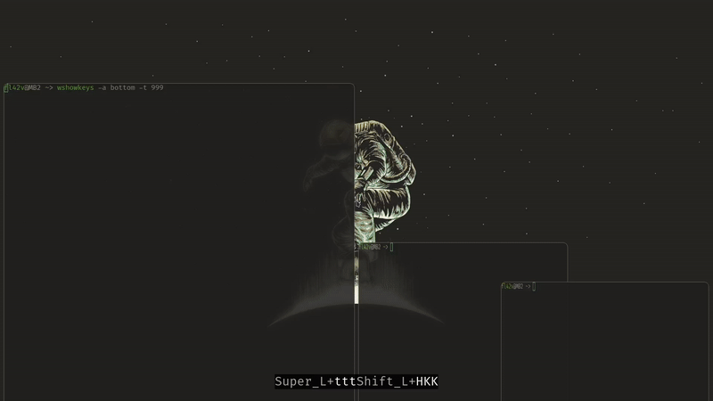

# Hyprjump
A hacky and pretty basic implementation of [Pop's cosmic](https://github.com/pop-os/cosmic-epoch)-like window movement for [Hyprland](https://github.com/hyprwm/hyprland).
Mandatory WIP.

# What?
Keybindings that focus a window also change workspace/monitor:
if you're trying to, for example, focus the window above the top window,
you go to the previous workspace instead. Likewise, attempting to swap the top window
with that above it will move it to the previous workspace. Same for monitors, except left/right instead of top/bottom.

# Demo
[](https://raw.githubusercontent.com/fl42v/hyprjump/main/assets/demo.mp4)

# Installation
- Once it works, there'll be a nix flake (currently a template);
- Otherwise, it's just `cargo build` and pointing to the target binary from the configuration.

# Configuration
add smth like this to your `hyprland.conf`:

```
bind=SUPER,h,exec,hyprjump movefocus workspace focusmonitor '' l
bind=SUPERSHIFT,h,exec,hyprjump movetoworkspace movewindow 'mon:' l
# same for d u r

```

## Vertical workspaces
hyprjump determines the orientation automatically by checking which style is used for `animations:animation-workspaces`.

# What is missing
- Restricting movement through unpopulated workspaces;
- Proper handling of the special workspace;
- Whatever I forgot to add here but specified in the `TODO`-comments;
- Updated demo
